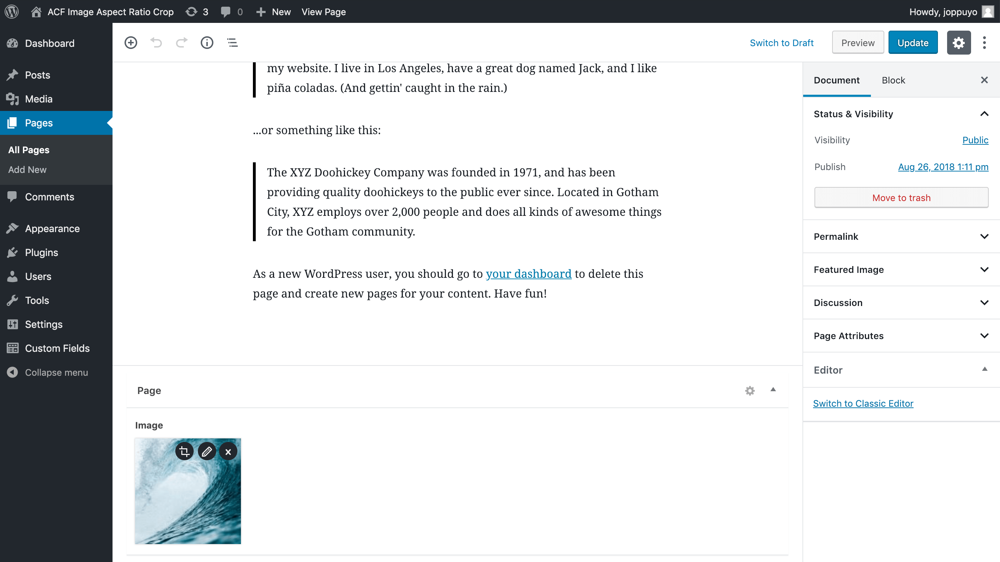

# ACF Image Aspect Ratio Crop Field

A field for Advanced Custom Field that forces the user to crop their image to specific aspect ratio after uploading. This is especially useful in responsive image use cases.

After cropping, a new cropped image variant is created in the gallery and saved into the post. Thumbnails are also generated for the new image. User can re-crop the original image at any time from the post page.

The cropped image variants are hidden by default in the media browser and on the media page but you can view them by selecting the "list view" on the media page.

## Cropping an image to 16:9 aspect ratio

## Option to re-crop the image after upload

## Thanks

Special thanks to Anders Thorborg for [ACF Image Crop](https://github.com/andersthorborg/ACF-Image-Crop) which served as a inspiration for this plugin. Also, thanks to Fengyuan Chen for the [cropper.js](https://fengyuanchen.github.io/cropperjs/) library!

## License

GPL v2 or later
