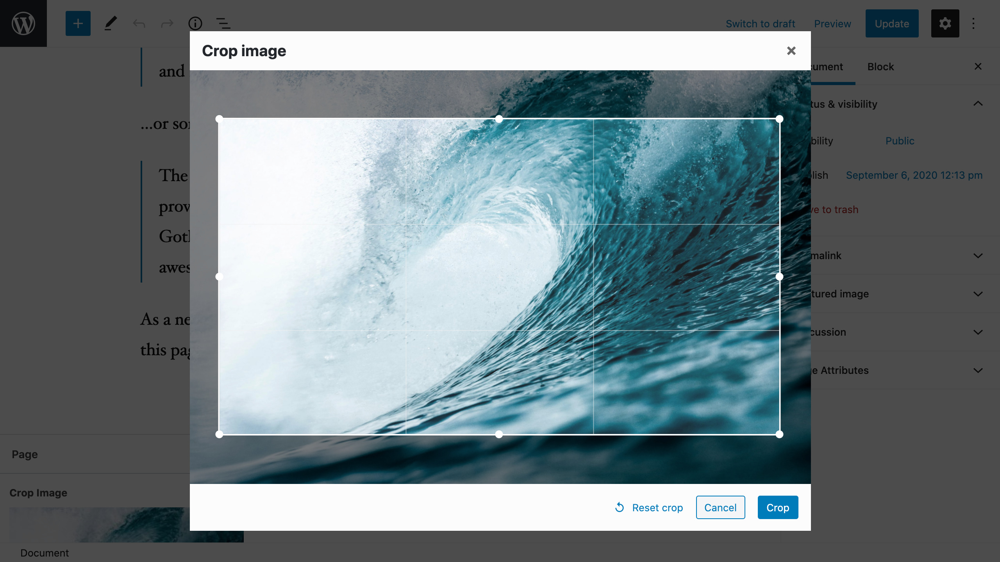
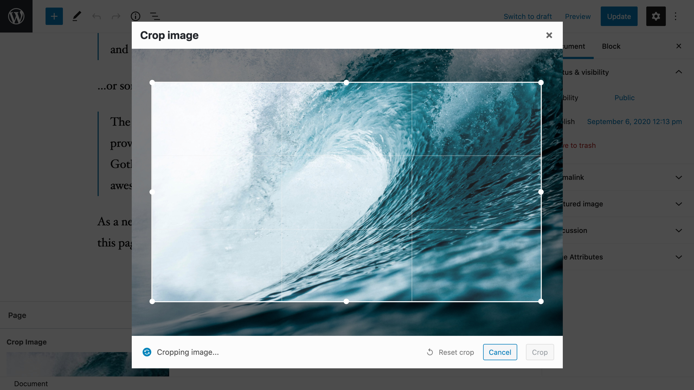

# ACF Image Aspect Ratio Crop Field

A field for Advanced Custom Fields that forces the user to crop their image to specific aspect ratio or pixel size after uploading. Using an aspect ratio is especially useful in responsive image use cases.

After cropping, a new cropped image variant is created in the gallery and saved into the post. Thumbnails are also generated for the new image. User can re-crop the original image at any time from the post page.

The cropped image variants are hidden by default in the media browser and on the media page but you can view them by selecting the "list view" on the media page.

## Modes of operation

There are three modes of operation: aspect ratio, pixel size and free crop. You can select this option when creating the field in ACF field options.

### Aspect ratio

Use this option if you want the image to be of specific aspect ratio like 16:9 but the pixel size is not important.

After selecting an image, user can select an area from the image that matches this aspect ratio. When crop button is pressed, the area is cropped from the original image.

If you need a smaller image size, you make use of WordPress's thumbnail functionality to access a smaller version of the image.

### Pixel size

Use this option if you need a specific pixel size image like 640x480. User will not be able to select an image smaller than the defined pixel size.

After selecting an image, user can select an area from the image they want, which can be larger than the pixel size but may not be smaller. The aspect ratio of the selection is locked according to the pixel size.

When crop button is pressed, the area is cropped from the original image. After the crop is complete, the image will be automatically scaled down to the pixel size. This means the final image will always be the specified size.

### Free crop

Crop can be done freely, there are no aspect ratio limitations.

## Screenshots

### Cropping an image to 16:9 aspect ratio

### Cropping in progress

### Option to re-crop the image after upload

## Download

You can download the plugin from the [WordPress plugin directory](https://wordpress.org/plugins/acf-image-aspect-ratio-crop/), or download the latest release as a zip file from [GitHub releases](https://github.com/joppuyo/acf-image-aspect-ratio-crop/releases).

## Requirements

- WordPress 4.9 or later
- PHP 5.6 or later
- Advanced Custom Fields 5.8 or later (Pro or Free)

## Compatiblity

- Polylang Pro
- Enable Media Replace
- WP Offload Media, Media Cloud and other plugins that move media files to remote location

## Frequently Asked Questions

### Can I use this plugin with a front-end acf_form?

Yes, this functionality has been added in version 5.0.0. Please test it and give feedback if you encounter any issues.

### Can I access metadata in the original image from a cropped image?

Yes, the original image data is saved under `original_image` key in the returned ACF array. You can access data such as alt text, description and title this way.

### Can I use this plugin with Elementor?

No, not really. Elementor only supports built-in ACF fields. Please contact Elementor support and ask them to add support for 3rd party fields. For some workarounds for limited Elementor support, see this [post](https://wordpress.org/support/topic/excellent-plugin-5518/).

### Can I use this plugin with Beaver Builder?

No, not really. Beaver Builder only supports built-in ACF fields. Please contact Beaver Builder support and ask them to add support for 3rd party fields. However, there is a work around this limitation by using a plugin called "Toolbox For Beaver Builder". Please [see their website](https://beaverplugins.com/) for more details.

### How is this different from the other plugin?

This plugin is similar to [Advanced Custom Fields: Image Crop Add-on](https://wordpress.org/plugins/acf-image-crop-add-on/). I originally created a fork of that plugin to add functionality I need: specifying an aspect ratio instead of pixel size. Unfortunately the plugin doesn't seem to be maintained anymore so my pull request was not merged.

So I created **ACF Image Aspect Ratio Crop** from scratch as an alternative to **ACF Image Crop**.

Possibility to use a pixel size instead of aspect ratio was added later on because I got so many requests for adding that feature.

The other plugin is not actively maintained and does not work well with latest ACF versions. I try to maintain this plugin as best as I can when new versions of ACF and WordPress come out.

## Thanks

Special thanks to Anders Thorborg for [ACF Image Crop](https://github.com/andersthorborg/ACF-Image-Crop) which served as a inspiration for this plugin. Also, thanks to Fengyuan Chen for the [cropper.js](https://fengyuanchen.github.io/cropperjs/) library!

## License

GPL v2 or later
